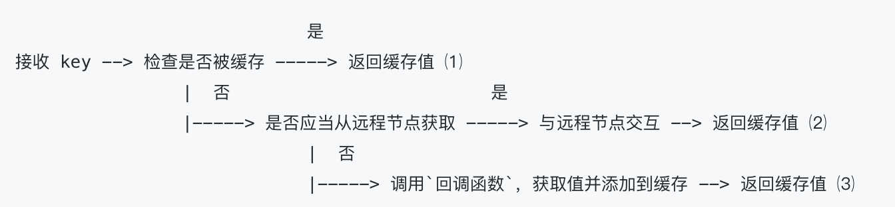

<!--
 * @Author: Qile Liang
 * @Date: 2023-01-10 16:12:01
 * @LastEditTime: 2023-01-10 18:47:07
 * @LastEditors: Qile Liang
 * @Description: 
 * @FilePath: /distributed-cache/python-cache/day2-single-node/notes.md
 * @Email: liangqile@outlook.com
-->
# 单机并发缓存
## byteview类
byteview中存储byte类型的数据，方便各类数据的传输。
## cache类与并发控制
使用multiprocessing包中的lock，该lock可以用with语法打开，更优雅且好看出来锁结束的位置。其余便是封装lru的一些常规的存储工作。其中lru实例的新建采用懒汉式的方式实现，也就是当add时发现不存在lru时才进行创建。
## Group类，负责与用户的交互和数据获取等流程
其流程图如下:   

当前先实现了1和3。 每新建一个group时需要传入一个该group的回调函数。（在其他语言中可以对该类设定一个interface，但是我研究了一下python面向对象中的抽象基类，似乎不太好完成这个任务，回头再继续研究解决方案）。在对group进行操作时也应该用锁将其锁住。
group类中最重要的是get方法。在get方法中若缓存命中则直接返回value，若缓存没有命中则调用load方法。该方法中目前主要实现了本地的缓存查询。调用回调函数get来获取缓存中不存在的数据并存储到cache中。 
### 全局变量groups的修改 
关于**全局变量groups**，可以注意到，在python的包管理中，只要正确import了需要修改的全局变量所在的包，则可以正常修改全局变量。其在相同的命名空间中，引用后的变量都存储在sys.module中。需要注意的是 **使用 from mypackage import  variable是不行的** 因为
``` python
#换种说法
from my_package import x
#等同于
improt my_package
x= my_package.x
#你调用x的时候，就是自己的命名空间中的x
#当你执行x=2时，完全影响不到glovar.x
```
该变量的命名空间属于当前文件，并不是import出来的变量。